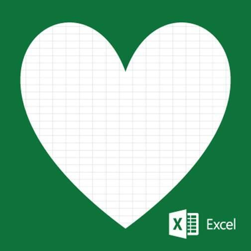

Image from [tweet](https://twitter.com/office/status/326733209779990528) by Microsoft's [Office account](https://twitter.com/Office)

_I originally wrote this in March of 2016 when I was between projects. I'm not entirely sure why._

I remember when we first met. I was in college. You were 20 years old but mature and feature rich for your age. Everyone thought you were boring, and I did too. But that was before I really _knew_ you. And being the immature 21 year old that I was, I just wasn’t ready to commit to the time and patience that was necessary to appreciate your intricacies.

College ended and we went our separate ways. Our paths crossed occasionally during my first few years after graduating, talking with you here and there during my first job. But I still wasn’t ready.

It wasn’t until fate brought us back together in that magical summer of 2011 and I realized how much I was missing. Why didn’t you tell me the hot key to automatically add filters to the current selection? And pivot tables, your dirty little secret that you kept from me during my youthful years that could have helped me so much during those hard times crunching numbers for Econ papers. And of course, one does not know love and passion until they understand your ability to dynamically pull data from a range like you do with VLOOKUP.

Few understand these parts of you. But I did. And I loved you for it.

As the months went on, our relationship developed into a more mature, macro-based one. You helped me automated my entire job, preventing me from having to endure the mundane task of data entry and report building. By providing this support, you allowed me to flourish intellectually, where I learned logical constructs and what the hell `Object reference is not an instance of an object` means.

However, after the initial honeymoon phase, the passion that we shared started to fizzle. As our relationship matured, my attention started to stray to other technologies; those that offered things that you offered, but in a different and non-Visual Basic for Application way. It wasn’t your fault that you didn’t offer what I needed and before I tried to use you in a way that you weren’t intended, I knew that I needed to end our relationship and move over to a different, more robust and interesting technological toolset.

Our breakup was abrupt and I apologize that I didn’t offer more of an explanation or warning but know this; without you, I wouldn’t be the programmer I am today. You showed me how to love (technology tools) and love myself (through developing programmatic solutions to repetitive tasks).

I will never forget that. And I will never forget you.
